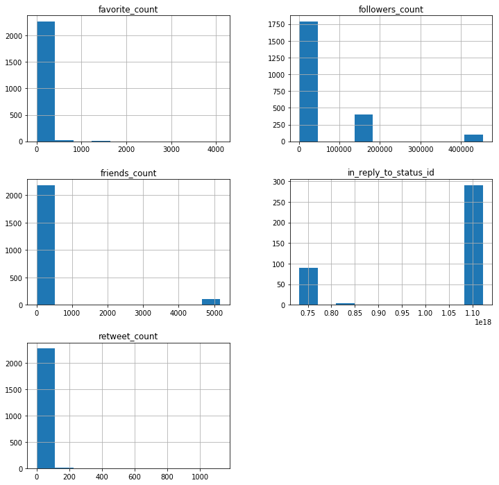
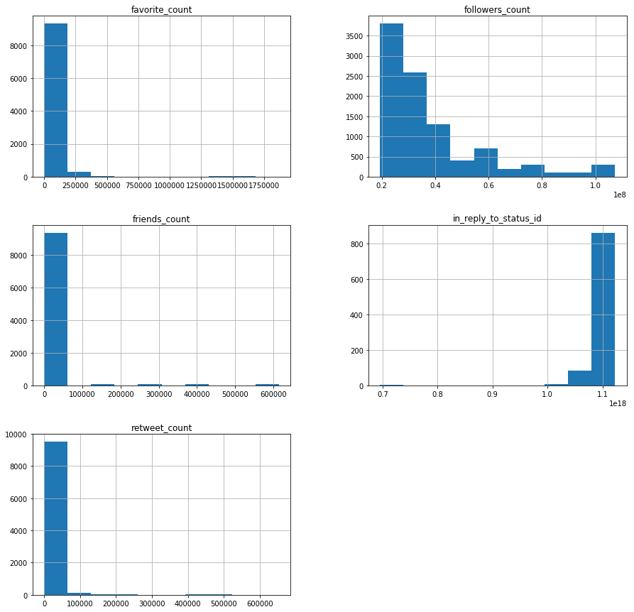
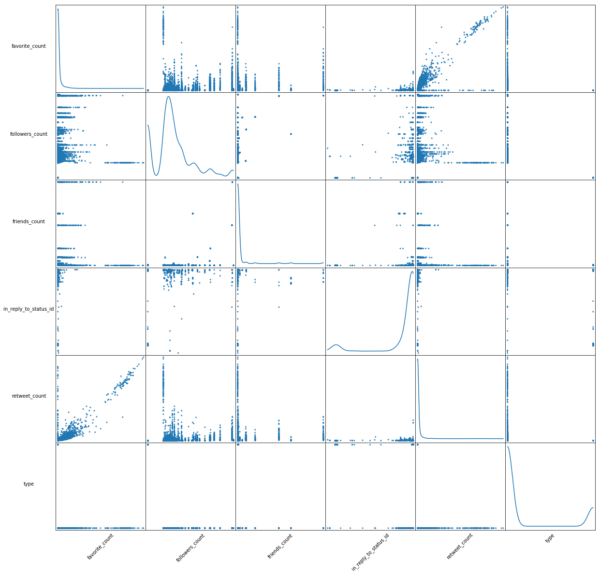

## Contents
{:.no_toc}
*  
{: toc}

<hr style="height:2pt">


## Data Resources

Data is mined and collected from the Twitter developer API (using tweepy). Twitter API passes json format data, we fetched them for two groups of users, i) 23 famous bots ii)100 famous verified real accounts. We saved the fetched tweets from both group after cleaning as a dataframe format in a csv file. We have a bit over 12,000 tweets and we plan to increase this database. For each tweet, we have 28 variables that describe some feature of the tweet.

## Preliminary EDA

Based on preliminary EDA and histograms it seems that the following features can have predicting power:
- Followers Count
- Friends Count
- Favorites Count
- Retweet Count 

As we continued to explore our data and learned more about the variables, this changed a bit. For our preliminary EDA, we used the following accounts to understand a bit about how the data is structured. This data consisted of 2,287 tweets:

```Python
count = 100
screen_names = ['@_grammar_','@attention_cnn','@NYT4thDownBot','@oliviataters','@DearAssistant','@a_quilt_bot',
                '@reverseocr', '@accidental575','@JustToSayBot','@FavThingsBot','@portmanteau_bot','@BloombrgNewsish',
                '@AwlTags',
                '@TinyCareBot','@simpscreens','@censusAmericans',' @everycolorbot','@pentametron','@AutoCharts',
                '@big_ben_clock', ' @everycolorbot','@RealHumanPraise','@wayback_exe'
               ] #,,'@pixelsorter'

tweets = fetch_tweets(screen_names,count)
```

Data structure was as follows:

<table class="dataframe" border="1">
  <thead>
    <tr>
      <th></th>
      <th>country_code</th>
      <th>created_at</th>
      <th>favorite_count</th>
      <th>favorited</th>
      <th>followers_count</th>
      <th>friends_count</th>
      <th>geo</th>
      <th>geo_enabled</th>
      <th>hashtags</th>
      <th>id</th>
      <th>...</th>
      <th>name</th>
      <th>place_type</th>
      <th>protected</th>
      <th>retweet_count</th>
      <th>screen_name</th>
      <th>source</th>
      <th>text</th>
      <th>url</th>
      <th>urls</th>
      <th>verified</th>
    </tr>
  </thead>
  <tbody>
    <tr>
      <th>0</th>
      <td>AQ</td>
      <td>Mon Jun 25 16:06:39 +0000 2012</td>
      <td>2</td>
      <td>False</td>
      <td>45802</td>
      <td>2</td>
      <td>{'type': 'Point', 'coordinates': [-89.09786011...</td>
      <td>True</td>
      <td>[]</td>
      <td>4d25f30d2fbf1463</td>
      <td>...</td>
      <td>Antarctica</td>
      <td>country</td>
      <td>False</td>
      <td>0</td>
      <td>_grammar_</td>
      <td>&lt;a href="https://twitter.com/Your_Grammar" rel...</td>
      <td>I declare this message by you, @sprintcare, un...</td>
      <td>http://t.co/y2OxdNwM0Y</td>
      <td>[{'url': 'https://t.co/YN2ntm6tBp', 'expanded_...</td>
      <td>False</td>
    </tr>
    <tr>
      <th>1</th>
      <td>None</td>
      <td>Mon Jun 25 16:06:39 +0000 2012</td>
      <td>0</td>
      <td>False</td>
      <td>45802</td>
      <td>2</td>
      <td>{'type': 'Point', 'coordinates': [-57.40262096...</td>
      <td>True</td>
      <td>[]</td>
      <td>None</td>
      <td>...</td>
      <td>None</td>
      <td>None</td>
      <td>False</td>
      <td>0</td>
      <td>_grammar_</td>
      <td>&lt;a href="https://twitter.com/Your_Grammar" rel...</td>
      <td>It was possible for you, @BoxeoMundial, to hav...</td>
      <td>http://t.co/y2OxdNwM0Y</td>
      <td>[]</td>
      <td>False</td>
    </tr>
    <tr>
      <th>2</th>
      <td>None</td>
      <td>Mon Jun 25 16:06:39 +0000 2012</td>
      <td>4</td>
      <td>False</td>
      <td>45802</td>
      <td>2</td>
      <td>{'type': 'Point', 'coordinates': [-59.7565709,...</td>
      <td>True</td>
      <td>[]</td>
      <td>None</td>
      <td>...</td>
      <td>None</td>
      <td>None</td>
      <td>False</td>
      <td>0</td>
      <td>_grammar_</td>
      <td>&lt;a href="https://twitter.com/Your_Grammar" rel...</td>
      <td>I insist that it would have been better if you...</td>
      <td>http://t.co/y2OxdNwM0Y</td>
      <td>[{'url': 'https://t.co/I4TBAoxzw3', 'expanded_...</td>
      <td>False</td>
    </tr>
    <tr>
      <th>3</th>
      <td>None</td>
      <td>Mon Jun 25 16:06:39 +0000 2012</td>
      <td>1</td>
      <td>False</td>
      <td>45802</td>
      <td>2</td>
      <td>{'type': 'Point', 'coordinates': [57.07041009,...</td>
      <td>True</td>
      <td>[]</td>
      <td>None</td>
      <td>...</td>
      <td>None</td>
      <td>None</td>
      <td>False</td>
      <td>0</td>
      <td>_grammar_</td>
      <td>&lt;a href="https://twitter.com/Your_Grammar" rel...</td>
      <td>I discovered @Bmac0507 ought to type “Marvel [...</td>
      <td>http://t.co/y2OxdNwM0Y</td>
      <td>[]</td>
      <td>False</td>
    </tr>
    <tr>
      <th>4</th>
      <td>None</td>
      <td>Mon Jun 25 16:06:39 +0000 2012</td>
      <td>6</td>
      <td>False</td>
      <td>45802</td>
      <td>2</td>
      <td>{'type': 'Point', 'coordinates': [27.58900536,...</td>
      <td>True</td>
      <td>[]</td>
      <td>None</td>
      <td>...</td>
      <td>None</td>
      <td>None</td>
      <td>False</td>
      <td>0</td>
      <td>_grammar_</td>
      <td>&lt;a href="https://twitter.com/Your_Grammar" rel...</td>
      <td>I consider this update by you, @EwanMacKenna, ...</td>
      <td>http://t.co/y2OxdNwM0Y</td>
      <td>[{'url': 'https://t.co/bEN4JKvwsa', 'expanded_...</td>
      <td>False</td>
    </tr>
  </tbody>
</table>
<p>5 rows × 23 columns</p>


## EDA

### Bot Generated Tweets




### Human Generated Tweets



### Scatter Matrix


