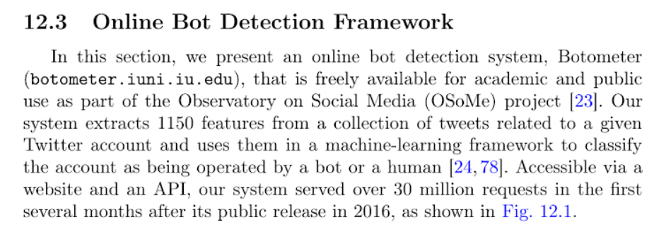
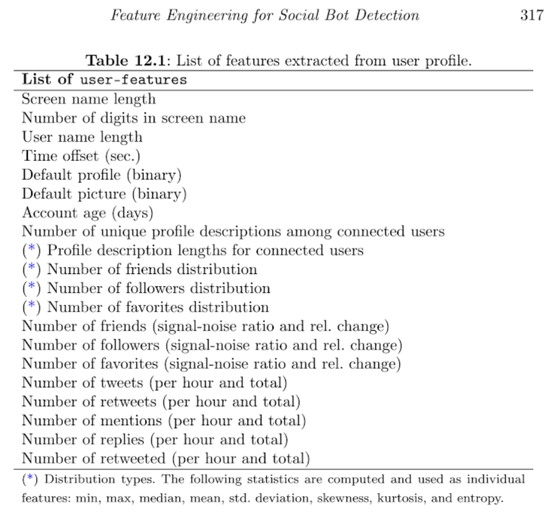
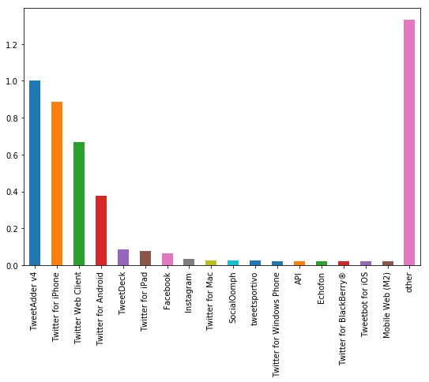

## Contents
{:.no_toc}
*  
{: toc}

<hr style="height:2pt">

## Data Cleaning and Feature Engineering

We now turn to data cleaning and feature engineering for use in neural network for detecting bots. As we searched the literature on how to approach this problem, we learned that feature engineering was key to developing a good set of predictors that helps improve the accuracy of the model. We took advice from the work done with Botometer, a network used for detection of bots created by Indiana University (https://botometer.iuni.iu.edu/#!/). As seen in the image below, obtained from Botometer's literature, they created over 1000 features for use in their network. We were not so ambitious as this is mostly for learning purposes, but we gathered that feature engineering was important for this work to produce good results.




We proceeded to continue to clean data as we learned more about its structure and generated features as we progressed through the data.

We noticed that some columns contained no information at all. This next section of code checks for columns that contain no information and drops these columns from the dataframe.

```Python
numerics = ['int16', 'int32', 'int64', 'float16', 'float32', 'float64']

empty_cols = []
for c in df.select_dtypes(include=numerics).columns:
    if len(np.isnan(df[c].unique()))==1 & np.isnan(df[c].unique())[0]:
        empty_cols.append(c)

df = df.drop(empty_cols, axis=1)
print('The following columns only contained nulls: {0}, these have been dropped'.format(empty_cols))

Output:
The following columns only contained nulls: ['favorited', 'geo', 'retweeted'], these have been dropped
```
A description of data results in the following table:


<table class="dataframe" border="1">
  <thead>
    <tr>
      <th></th>
      <th>favorite_count</th>
      <th>num_hashtags</th>
      <th>num_mentions</th>
      <th>num_urls</th>
      <th>possibly_sensitive</th>
      <th>reply_count</th>
      <th>retweet_count</th>
      <th>truncated</th>
      <th>bots</th>
    </tr>
  </thead>
  <tbody>
    <tr>
      <th>count</th>
      <td>6.637615e+06</td>
      <td>6.637615e+06</td>
      <td>6.637615e+06</td>
      <td>6.637615e+06</td>
      <td>26812.0</td>
      <td>6.637615e+06</td>
      <td>6.637615e+06</td>
      <td>753.0</td>
      <td>6.637616e+06</td>
    </tr>
    <tr>
      <th>mean</th>
      <td>2.352860e+00</td>
      <td>1.561749e-01</td>
      <td>3.908975e-01</td>
      <td>2.003855e-01</td>
      <td>1.0</td>
      <td>2.848357e-02</td>
      <td>3.832842e+02</td>
      <td>1.0</td>
      <td>5.722317e-01</td>
    </tr>
    <tr>
      <th>std</th>
      <td>3.313966e+02</td>
      <td>5.913658e-01</td>
      <td>7.311432e-01</td>
      <td>4.062391e-01</td>
      <td>0.0</td>
      <td>1.474201e+01</td>
      <td>1.100351e+04</td>
      <td>0.0</td>
      <td>4.947551e-01</td>
    </tr>
    <tr>
      <th>min</th>
      <td>-1.000000e+00</td>
      <td>0.000000e+00</td>
      <td>0.000000e+00</td>
      <td>0.000000e+00</td>
      <td>1.0</td>
      <td>0.000000e+00</td>
      <td>0.000000e+00</td>
      <td>1.0</td>
      <td>0.000000e+00</td>
    </tr>
    <tr>
      <th>25%</th>
      <td>0.000000e+00</td>
      <td>0.000000e+00</td>
      <td>0.000000e+00</td>
      <td>0.000000e+00</td>
      <td>1.0</td>
      <td>0.000000e+00</td>
      <td>0.000000e+00</td>
      <td>1.0</td>
      <td>0.000000e+00</td>
    </tr>
    <tr>
      <th>50%</th>
      <td>0.000000e+00</td>
      <td>0.000000e+00</td>
      <td>0.000000e+00</td>
      <td>0.000000e+00</td>
      <td>1.0</td>
      <td>0.000000e+00</td>
      <td>0.000000e+00</td>
      <td>1.0</td>
      <td>1.000000e+00</td>
    </tr>
    <tr>
      <th>75%</th>
      <td>0.000000e+00</td>
      <td>0.000000e+00</td>
      <td>1.000000e+00</td>
      <td>0.000000e+00</td>
      <td>1.0</td>
      <td>0.000000e+00</td>
      <td>0.000000e+00</td>
      <td>1.0</td>
      <td>1.000000e+00</td>
    </tr>
    <tr>
      <th>max</th>
      <td>1.353000e+05</td>
      <td>2.800000e+01</td>
      <td>1.900000e+01</td>
      <td>6.000000e+00</td>
      <td>1.0</td>
      <td>2.751600e+04</td>
      <td>3.350111e+06</td>
      <td>1.0</td>
      <td>1.000000e+00</td>
    </tr>
  </tbody>
</table>

we noticed from the describe command above that some columns have very few observations ('possibly_sensitive' and 'truncated'). Reading Twitter's API pages about these two variables, we determined that it was safe to drop these variables for analysis as 1) they have too few observations, and 2) the values are not very useful as they are proxies of other variables.

See https://developer.twitter.com/en/docs/tweets/data-dictionary/overview/tweet-object.html for information about variables

We then look at the data a bit:


<table class="dataframe" border="1">
  <thead>
    <tr>
      <th></th>
      <th>contributors</th>
      <th>crawled_at</th>
      <th>created_at</th>
      <th>favorite_count</th>
      <th>id</th>
      <th>in_reply_to_screen_name</th>
      <th>in_reply_to_status_id</th>
      <th>in_reply_to_user_id</th>
      <th>num_hashtags</th>
      <th>num_mentions</th>
      <th>...</th>
      <th>place</th>
      <th>reply_count</th>
      <th>retweet_count</th>
      <th>retweeted_status_id</th>
      <th>source</th>
      <th>text</th>
      <th>timestamp</th>
      <th>updated</th>
      <th>user_id</th>
      <th>bots</th>
    </tr>
  </thead>
  <tbody>
    <tr>
      <th>0</th>
      <td>NaN</td>
      <td>2015-05-01 12:57:19</td>
      <td>Fri May 01 00:18:11 +0000 2015</td>
      <td>0.0</td>
      <td>593932392663912449</td>
      <td>NaN</td>
      <td>0</td>
      <td>0</td>
      <td>0.0</td>
      <td>1.0</td>
      <td>...</td>
      <td>NaN</td>
      <td>0.0</td>
      <td>1.0</td>
      <td>593932168524533760</td>
      <td>&lt;a href="http://tapbots.com/tweetbot" rel="nof...</td>
      <td>RT @morningJewshow: Speaking about Jews and co...</td>
      <td>2015-05-01 02:18:11</td>
      <td>2015-05-01 12:57:19</td>
      <td>678033</td>
      <td>0.0</td>
    </tr>
    <tr>
      <th>1</th>
      <td>NaN</td>
      <td>2015-05-01 12:57:19</td>
      <td>Thu Apr 30 21:50:52 +0000 2015</td>
      <td>0.0</td>
      <td>593895316719423488</td>
      <td>NaN</td>
      <td>0</td>
      <td>0</td>
      <td>0.0</td>
      <td>0.0</td>
      <td>...</td>
      <td>NaN</td>
      <td>0.0</td>
      <td>0.0</td>
      <td>0</td>
      <td>&lt;a href="http://twitter.com" rel="nofollow"&gt;Tw...</td>
      <td>This age/face recognition thing..no reason pla...</td>
      <td>2015-04-30 23:50:52</td>
      <td>2015-05-01 12:57:19</td>
      <td>678033</td>
      <td>0.0</td>
    </tr>
    <tr>
      <th>2</th>
      <td>NaN</td>
      <td>2015-05-01 12:57:19</td>
      <td>Thu Apr 30 20:52:32 +0000 2015</td>
      <td>0.0</td>
      <td>593880638069018624</td>
      <td>NaN</td>
      <td>0</td>
      <td>0</td>
      <td>2.0</td>
      <td>0.0</td>
      <td>...</td>
      <td>NaN</td>
      <td>0.0</td>
      <td>0.0</td>
      <td>0</td>
      <td>&lt;a href="http://twitter.com" rel="nofollow"&gt;Tw...</td>
      <td>Only upside of the moment I can think of is th...</td>
      <td>2015-04-30 22:52:32</td>
      <td>2015-05-01 12:57:19</td>
      <td>678033</td>
      <td>0.0</td>
    </tr>
    <tr>
      <th>3</th>
      <td>NaN</td>
      <td>2015-05-01 12:57:19</td>
      <td>Thu Apr 30 18:42:40 +0000 2015</td>
      <td>1.0</td>
      <td>593847955536252928</td>
      <td>NaN</td>
      <td>0</td>
      <td>0</td>
      <td>2.0</td>
      <td>0.0</td>
      <td>...</td>
      <td>NaN</td>
      <td>0.0</td>
      <td>2.0</td>
      <td>0</td>
      <td>&lt;a href="http://tapbots.com/tweetbot" rel="nof...</td>
      <td>If you're going to think about+create experien...</td>
      <td>2015-04-30 20:42:40</td>
      <td>2015-05-01 12:57:19</td>
      <td>678033</td>
      <td>0.0</td>
    </tr>
    <tr>
      <th>4</th>
      <td>NaN</td>
      <td>2015-05-01 12:57:19</td>
      <td>Thu Apr 30 18:41:36 +0000 2015</td>
      <td>0.0</td>
      <td>593847687847350272</td>
      <td>NaN</td>
      <td>0</td>
      <td>0</td>
      <td>0.0</td>
      <td>0.0</td>
      <td>...</td>
      <td>NaN</td>
      <td>0.0</td>
      <td>0.0</td>
      <td>0</td>
      <td>&lt;a href="http://tapbots.com/tweetbot" rel="nof...</td>
      <td>Watching a thread on FB about possible future ...</td>
      <td>2015-04-30 20:41:36</td>
      <td>2015-05-01 12:57:19</td>
      <td>678033</td>
      <td>0.0</td>
    </tr>
  </tbody>
</table>
<p>5 rows × 21 columns</p>

We also noticed that columns 'contributors', 'in_reply_to_screen_name', and 'place' appear to have lots of NaNs, we looked at the columns to see if they contained useful information:

```Python
for c in ['contributors', 'in_reply_to_screen_name', 'place']:
    print('column {:s} has {:d} unique values:'.format(c, len(df[c].unique())))
    print(df[c].unique())
    print()
    
Output:
column contributors has 1 unique values:
[nan]

column in_reply_to_screen_name has 271336 unique values:
[nan 'thelancearthur' 'wkamaubell' ... 'QueenBitchEnt' 'QBLilKim'
 'TokyozFinest1']

column place has 3191 unique values:
[nan 'Tucson, AZ' 'Casas Adobes, AZ' ... 'Cártama, Malaga'
 'Chalco, Messico' 'Universiti Multimedia, Bukit Baru']
```

The 'contributors' column is empty so we removed it. The other two columns did contain information about tweets and we decided to keep them.

### Checking for Null Values

We check if some columns that should contain a numerical value contain any Null values.

```Python
for c in df.columns:
    if df[c].isna().sum() > 0:
        print('column {:s} has {:d} null values'.format(c, df[c].isna().sum()))

Output:
column crawled_at has 196028 null values
column created_at has 1 null values
column favorite_count has 1 null values
column in_reply_to_screen_name has 5598482 null values
column in_reply_to_status_id has 1 null values
column in_reply_to_user_id has 1 null values
column num_hashtags has 1 null values
column num_mentions has 1 null values
column num_urls has 1 null values
column place has 6508965 null values
column reply_count has 1 null values
column retweet_count has 1 null values
column retweeted_status_id has 196028 null values
column source has 73 null values
column text has 13007 null values
column timestamp has 1 null values
column updated has 196028 null values
column user_id has 1 null values
```

We noticed a few things here: There are several columns with only 1 null value, and some columns with many null values. We explored further to determine if we could fill this missing data or if we could drop them.

We first checked all columns that contain only 1 null, maybe they all point the the exact same observation. if this is the case, then we could simply delete this observation and we would only loose a single data point.

```Python
single_nulls = ['created_at', 'favorite_count', 'in_reply_to_status_id',
                'in_reply_to_user_id', 'num_hashtags', 'num_mentions', 
                'num_urls', 'reply_count', 'retweet_count', 'timestamp', 'user_id']

for c in single_nulls:
    print('index {:d} is where the null is for column {:s}'.format(df.loc[df[c].isna()].index[0],c))
 
Output:
index 2839361 is where the null is for column created_at
index 2839361 is where the null is for column favorite_count
index 2839361 is where the null is for column in_reply_to_status_id
index 2839361 is where the null is for column in_reply_to_user_id
index 2839361 is where the null is for column num_hashtags
index 2839361 is where the null is for column num_mentions
index 2839361 is where the null is for column num_urls
index 2839361 is where the null is for column reply_count
index 2839361 is where the null is for column retweet_count
index 2839361 is where the null is for column timestamp
index 2839361 is where the null is for column user_id
```

As expected, they all correspond to same observation, so we deleted this observation.

columns 'crawled_at' and 'updated' were columns added by the researchers. They used twitter crawlers to collect information for this database. These columns do not belong to information about users that can be collected through Twitter's API, hence we decided to drop these two columns as well.

```Python
for c in df.columns:
    if df[c].isna().sum() > 0:
        print('column {:s} has {:d} null values'.format(c, df[c].isna().sum()))

Output: 
column in_reply_to_screen_name has 5598481 null values
column place has 6508964 null values
column retweeted_status_id has 196027 null values
column source has 72 null values
column text has 13006 null values
```

the varaibles 'in_reply_to_screen_name' and 'place have' large amounts of null values. When looking at Twitter's API description of these variables, we foudn that these values are null if:

    for in_reply_to_screen_name if the tweet is not a reply
    for place, if the tweet has no location data

This presented an interesting opportunity. We looked at what percentage of tweets that have either 'place' data or 'in_reply_to_screen_name' data correspond to genuine accounts.

```Python
df.loc[df.in_reply_to_screen_name.isna()==False].bots.sum()/len(df.loc[df.in_reply_to_screen_name.isna()==False])

Output:
0.20234637688690776

df.loc[df.place.isna()==False].bots.sum()/len(df.loc[df.place.isna()==False])

Output:
0.05719349247188129
```

These are interesting results. Of the tweets that are replies, only 20% come from bots. And of the tweets that have location data, only 5% come from bots.

Since the actual value of 'in_reply_to_screen_name' and 'place' variable is not very important as they have small sample sizes, we created a binary variable for each to indicate if a tweet is a reply, and if a tweet has place data. This might prove to be more useful than the actual value it currently holds. We dropped the original columns.

```Python
reply = np.zeros(len(df))
idx = df.loc[df.in_reply_to_screen_name.isna()==False].index
np.put(reply, idx, 1)

location_data = np.zeros(len(df))
idx = df.loc[df.place.isna()==False].index
np.put(location_data, idx, 1)

df['reply'] = reply
df['location_data'] = location_data

df = df.drop(['place','in_reply_to_screen_name', 'in_reply_to_status_id', 'in_reply_to_user_id', 'id'], axis=1)
```

Text feature, which corresponds to the text of the tweet also presents some missing data. We left this untouched for now. But we created a feature that counts the number of words in a tweet. Those tweets without text will be assumed to have 0 number of words.

```Python
num_words = []
for i, s in enumerate(df.text):
    try:
        num_words.append(len(s.split()))
    except AttributeError:
        num_words.append(0)

df['num_words'] = num_words
```

We searched information on what 'retweeted_status_id' represents and we did not find any good information on it. There is a variable on Twitter called 'retweeted_status', but it differs in data format from the one we have. Our guess is that the variable we have represents the id of the user for which the twitter is being retweeted. Since we were not going to acquiring additional data outside the dataset we received from the researchers, we decided to drop this column.

```Python
for c in df.columns:
    if df[c].isna().sum() > 0:
        print('column {:s} has {:d} null values'.format(c, df[c].isna().sum()))

Output:
column source has 72 null values
column text has 13006 null values
```

The 'source' column represents information related to the infrastructure/platform where the tweet came from. For example, if it was typed through twitter online, it will say so, if it was typed through twitter on a phone, it will say something like "twitter for android" or "twitter for ios", etc.

This is likely to prove to be an important feature. We filled the 72 missing values with the most common value as it is only 72 observations (tiny when compared to the number of total observations). Then, then categorized the sources from most common to least common into 10 categories and one-hot-encoded them.

```Python
source = df.source.str.extract(r'>\s*([^\.]*)\s*\<', expand=False)
source_counts = source.value_counts()
df = df.fillna({'source':source_counts.index[0]}, axis=0)
```

We looked at the distribution of 'source' to see how we can categorize them:

```Python
source_norm = (source_counts-source_counts.min())/(source_counts.max()-source_counts.min())


fig, ax = plt.subplots(figsize=(9,6))

threshold = 0.02
mask = source_norm > threshold
tail_prob = source_norm.loc[~mask].sum()
prob = source_norm.loc[mask]
prob['other'] = tail_prob
prob.plot(kind='bar')
plt.show()
```


We can observe from the above distribution that the most common values are 'TweetAdder v4', 'Twitter for iPhone', 'Twitter Web Client', and 'Twitter for Android'. We decided to split the data into 10 bins corresponding to the top 9 sources and then a single category for all the rest.

```Python
l = list(source_counts.index[0:9])
source_new = []
for s in source:
    if s in l:
        source_new.append(s)
    else:
        source_new.append('other')

df['source'] = source_new 
df = pd.get_dummies(df, columns=['source'])
```

It was important to manage the timestamp of tweets and engineer some features from this variable. We focused on extracting the year, month, day, hour, minutes and second in which a tweet was made; also for each unique user, how often they tweet. (This process took about 24 mintues to run).

```Python
df.created_at = pd.to_datetime(df.created_at, errors='coerce')
pd.isnull(df.created_at).sum()

Output:
145094
```

We have about 145,000 observations that don't contain data of when the tweet was created. We will delete these observations as we still have millions of observations to use in the model. We then created date features and stored them in a clean csv for later use.

```Python
df['year'] = df.created_at.dt.year
df['month'] = df.created_at.dt.month
df['day'] = df.created_at.dt.day
df['hour'] = df.created_at.dt.hour
df['minute'] = df.created_at.dt.minute
df['second'] = df.created_at.dt.second

df.to_csv('data/clean_tweets.csv')
```
