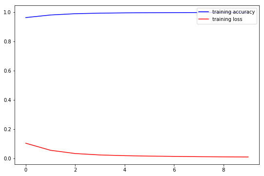
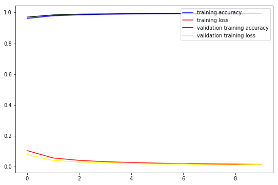

## Contents
{:.no_toc}
*  
{: toc}

<hr style="height:2pt">

## Modeling

For modeling, we take two approaches, we created a baseline model and then improve upon it. Both models are neural nets and produce a probability between 0 and 1 about whether a user is a bot (1) or not (0). Our networks estimate the probability that a given tweet comes from a bot or from a genuine account, we then average the probabilities of the tweets for a given user in order to estimate the probability that the user is a bot or not. In other words, this is a two step process:

1. Neural network predicts if a given tweet is from bot or not.
2. Average of predictions for each user is generated to predict whether a user is bot or not.

We do this as it is difficult to abstract from a single tweet (observation) if an account is genuine or from bot.

### Merging all clean datasets

We begin by reading in the cleaned datasets that we did and merge them together.

```Python
df_tweets = pd.read_csv("data/clean_tweets.csv", index_col=0)
df_users = pd.read_csv("data/clean_users.csv")
df_NN = df_tweets.merge(df_users, on="user_id", how="left").fillna("")

df_NN.describe()
```

<table class="dataframe" border="1">
  <thead>
    <tr>
      <th></th>
      <th>favorite_count</th>
      <th>num_hashtags</th>
      <th>num_mentions</th>
      <th>num_urls</th>
      <th>reply_count</th>
      <th>retweet_count</th>
      <th>user_id</th>
      <th>reply</th>
      <th>location_data</th>
      <th>num_words</th>
      <th>...</th>
      <th>day</th>
      <th>hour</th>
      <th>minute</th>
      <th>second</th>
      <th>favourites_count</th>
      <th>followers_count</th>
      <th>friends_count</th>
      <th>listed_count</th>
      <th>statuses_count</th>
      <th>bots</th>
    </tr>
  </thead>
  <tbody>
    <tr>
      <th>count</th>
      <td>6.492521e+06</td>
      <td>6.492521e+06</td>
      <td>6.492521e+06</td>
      <td>6.492521e+06</td>
      <td>6.492521e+06</td>
      <td>6.492521e+06</td>
      <td>6.492521e+06</td>
      <td>6.492521e+06</td>
      <td>6.492521e+06</td>
      <td>6.492521e+06</td>
      <td>...</td>
      <td>6.492521e+06</td>
      <td>6.492521e+06</td>
      <td>6.492521e+06</td>
      <td>6.492521e+06</td>
      <td>6.492521e+06</td>
      <td>6.492521e+06</td>
      <td>6.492521e+06</td>
      <td>6.492521e+06</td>
      <td>6.492521e+06</td>
      <td>6.492521e+06</td>
    </tr>
    <tr>
      <th>mean</th>
      <td>2.405442e+00</td>
      <td>1.565306e-01</td>
      <td>3.924238e-01</td>
      <td>1.897788e-01</td>
      <td>2.912012e-02</td>
      <td>3.918497e+02</td>
      <td>7.325286e+08</td>
      <td>1.583126e-01</td>
      <td>1.981526e-02</td>
      <td>1.255200e+01</td>
      <td>...</td>
      <td>1.655101e+01</td>
      <td>1.230295e+01</td>
      <td>2.936419e+01</td>
      <td>2.941542e+01</td>
      <td>2.500700e+03</td>
      <td>2.328122e+03</td>
      <td>1.338941e+03</td>
      <td>2.174600e+01</td>
      <td>1.405835e+04</td>
      <td>5.626720e-01</td>
    </tr>
    <tr>
      <th>std</th>
      <td>3.350790e+02</td>
      <td>5.931723e-01</td>
      <td>7.243254e-01</td>
      <td>3.978721e-01</td>
      <td>1.490583e+01</td>
      <td>1.112564e+04</td>
      <td>7.495175e+08</td>
      <td>3.650339e-01</td>
      <td>1.393651e-01</td>
      <td>6.678471e+00</td>
      <td>...</td>
      <td>9.296943e+00</td>
      <td>7.035330e+00</td>
      <td>1.737085e+01</td>
      <td>1.736926e+01</td>
      <td>7.913393e+03</td>
      <td>2.472806e+04</td>
      <td>3.179826e+03</td>
      <td>1.504893e+02</td>
      <td>2.699921e+04</td>
      <td>4.960567e-01</td>
    </tr>
    <tr>
      <th>min</th>
      <td>-1.000000e+00</td>
      <td>0.000000e+00</td>
      <td>0.000000e+00</td>
      <td>0.000000e+00</td>
      <td>0.000000e+00</td>
      <td>0.000000e+00</td>
      <td>6.780330e+05</td>
      <td>0.000000e+00</td>
      <td>0.000000e+00</td>
      <td>0.000000e+00</td>
      <td>...</td>
      <td>1.000000e+00</td>
      <td>0.000000e+00</td>
      <td>0.000000e+00</td>
      <td>0.000000e+00</td>
      <td>0.000000e+00</td>
      <td>0.000000e+00</td>
      <td>0.000000e+00</td>
      <td>0.000000e+00</td>
      <td>0.000000e+00</td>
      <td>0.000000e+00</td>
    </tr>
    <tr>
      <th>25%</th>
      <td>0.000000e+00</td>
      <td>0.000000e+00</td>
      <td>0.000000e+00</td>
      <td>0.000000e+00</td>
      <td>0.000000e+00</td>
      <td>0.000000e+00</td>
      <td>2.158760e+08</td>
      <td>0.000000e+00</td>
      <td>0.000000e+00</td>
      <td>7.000000e+00</td>
      <td>...</td>
      <td>8.000000e+00</td>
      <td>6.000000e+00</td>
      <td>1.400000e+01</td>
      <td>1.400000e+01</td>
      <td>0.000000e+00</td>
      <td>1.770000e+02</td>
      <td>1.980000e+02</td>
      <td>0.000000e+00</td>
      <td>4.900000e+02</td>
      <td>0.000000e+00</td>
    </tr>
    <tr>
      <th>50%</th>
      <td>0.000000e+00</td>
      <td>0.000000e+00</td>
      <td>0.000000e+00</td>
      <td>0.000000e+00</td>
      <td>0.000000e+00</td>
      <td>0.000000e+00</td>
      <td>4.836202e+08</td>
      <td>0.000000e+00</td>
      <td>0.000000e+00</td>
      <td>1.200000e+01</td>
      <td>...</td>
      <td>1.700000e+01</td>
      <td>1.300000e+01</td>
      <td>2.900000e+01</td>
      <td>2.900000e+01</td>
      <td>2.000000e+00</td>
      <td>6.080000e+02</td>
      <td>6.040000e+02</td>
      <td>3.000000e+00</td>
      <td>7.411000e+03</td>
      <td>1.000000e+00</td>
    </tr>
    <tr>
      <th>75%</th>
      <td>0.000000e+00</td>
      <td>0.000000e+00</td>
      <td>1.000000e+00</td>
      <td>0.000000e+00</td>
      <td>0.000000e+00</td>
      <td>0.000000e+00</td>
      <td>6.162066e+08</td>
      <td>0.000000e+00</td>
      <td>0.000000e+00</td>
      <td>1.800000e+01</td>
      <td>...</td>
      <td>2.500000e+01</td>
      <td>1.800000e+01</td>
      <td>4.400000e+01</td>
      <td>4.400000e+01</td>
      <td>1.632000e+03</td>
      <td>1.234000e+03</td>
      <td>1.652000e+03</td>
      <td>9.000000e+00</td>
      <td>1.263900e+04</td>
      <td>1.000000e+00</td>
    </tr>
    <tr>
      <th>max</th>
      <td>1.353000e+05</td>
      <td>2.800000e+01</td>
      <td>1.900000e+01</td>
      <td>6.000000e+00</td>
      <td>2.751600e+04</td>
      <td>3.350111e+06</td>
      <td>2.525273e+09</td>
      <td>1.000000e+00</td>
      <td>1.000000e+00</td>
      <td>6.900000e+01</td>
      <td>...</td>
      <td>3.100000e+01</td>
      <td>2.300000e+01</td>
      <td>5.900000e+01</td>
      <td>5.900000e+01</td>
      <td>1.854670e+05</td>
      <td>9.868370e+05</td>
      <td>9.086100e+04</td>
      <td>4.840000e+03</td>
      <td>3.335040e+05</td>
      <td>1.000000e+00</td>
    </tr>
  </tbody>
</table>
<p>8 rows × 32 columns</p>


### Splitting and preparing data for model

Once we merged the datasets and have a single datasets with no missing information, we prepare the data for analysis. An important step is to split the test and train data based on users as the labeling form the researchers came as such. In other words, the label for bot or not bot is at the user level and not at the tweet level. As such, we make sure to separate train and test at user level first.

Another way to put it, we randomly select 20% of users and create a test set of the tweets and features pertaining to these users. Information from these users will not be contained in the training set.

```Python
unique_users = df_NN.user_id.unique()

np.random.seed(42)
user_id_test = np.random.choice(unique_users, size = int(0.2*len(unique_users)))

test_df_by_usr = df_NN[df_NN.user_id.isin(user_id_test)]
train_df_by_user = df_NN[df_NN.user_id.isin(set(user_id_test)^set(unique_users))]

y_df_NN = train_df_by_user.bots
X_df_NN = train_df_by_user.drop(columns = ["created_at", "text", "timestamp", "user_id",
                                           "bots", "year", "month", "day", "hour", "minute"], axis = 1)
```

Split and verify that it worked:
```Python
X_train, X_test, y_train, y_test = train_test_split(X_df_NN, y_df_NN, test_size=0.3, random_state=42, stratify = y_df_NN)
X_train.shape[0]/(X_train.shape[0] + X_test.shape[0])

Output:
0.7

y_train.value_counts()

Output:
1.0    2107330
0.0    1601494
Name: bots, dtype: int64

# testing that stratify worked as wanted
print (y_train.value_counts()[0]/(y_train.value_counts()[1]+y_train.value_counts()[0]))
print (y_test.value_counts()[0]/(y_test.value_counts()[1]+y_test.value_counts()[0]))

Output:
0.4318064162656411
0.4318060567626468
````

Normalize data:
```Python
scaler = MinMaxScaler()

transformer = scaler.fit(X_train)
X_train_scaled = pd.DataFrame(transformer.transform(X_train))

X_test_scaled = pd.DataFrame(transformer.transform(X_test))
```

### Baseline model

Build, train, predict and check accuracy of baseline model, upon which we will build and improve in our final model

```Python
input_dim = X_train_scaled.shape[1]

num_classes = 1
nodes = 100

baseline_model = Sequential()

baseline_model.add(Dense(nodes, activation='relu', kernel_initializer='uniform', 
                input_dim = input_dim))

baseline_model.add(Dense(nodes, activation='relu'))
baseline_model.add(Dense(nodes, activation='relu'))
baseline_model.add(Dense(nodes, activation='relu'))
baseline_model.add(Dense(nodes, activation='relu'))
baseline_model.add(Dense(nodes, activation='relu'))
baseline_model.add(Dense(nodes, activation='relu'))

baseline_model.add(Dense(num_classes, kernel_initializer='uniform', activation='sigmoid'))

# compile the model
baseline_model.compile(loss='binary_crossentropy',
              optimizer='adam',
              metrics=['acc'])

Output:
Epoch 1/10
3708824/3708824 [==============================] - 31s 8us/step - loss: 0.1026 - acc: 0.9618
Epoch 2/10
3708824/3708824 [==============================] - 26s 7us/step - loss: 0.0543 - acc: 0.9796
Epoch 3/10
3708824/3708824 [==============================] - 26s 7us/step - loss: 0.0321 - acc: 0.9884
Epoch 4/10
3708824/3708824 [==============================] - 26s 7us/step - loss: 0.0223 - acc: 0.9922
Epoch 5/10
3708824/3708824 [==============================] - 26s 7us/step - loss: 0.0175 - acc: 0.9941
Epoch 6/10
3708824/3708824 [==============================] - 26s 7us/step - loss: 0.0145 - acc: 0.9951
Epoch 7/10
3708824/3708824 [==============================] - 26s 7us/step - loss: 0.0126 - acc: 0.9959
Epoch 8/10
3708824/3708824 [==============================] - 26s 7us/step - loss: 0.0106 - acc: 0.9964
Epoch 9/10
3708824/3708824 [==============================] - 26s 7us/step - loss: 0.0095 - acc: 0.9968
Epoch 10/10
3708824/3708824 [==============================] - 26s 7us/step - loss: 0.0086 - acc: 0.9972
CPU times: user 5min 12s, sys: 43.3 s, total: 5min 55s
Wall time: 4min 25s

fig, ax = plt.subplots(figsize=(9, 6))
ax.plot(np.array(baseline_model_history.history['acc']), color='blue', label='training accuracy')
ax.plot(np.array(baseline_model_history.history['loss']), color='red', label='training loss')
# ax.set_title('optimizer={}, lr={}'.format('Adam', lr))
ax.legend(loc='upper right')
plt.show()
```



We see that our base model learns as it progresses through the epochs. We have good scores for training accuracy in each epoch, but let's test overall performance.

```Python
# evaluate the training and testing performance of our model 
score = baseline_model.evaluate(X_train, y_train, verbose=0)
# get the class probabilities predicted by our MLP on the training set
y_pred = baseline_model.predict(X_train)
y_pred[y_pred > 0.5] = 1
y_pred[y_pred <= 0.5] = 0
print('Train confusion matrix:\n', confusion_matrix(y_train, y_pred))
print('Train loss:', score[0])
print('Train accuracy:', score[1])

Output:
Train confusion matrix:
 [[1532805   68689]
 [1171047  936283]]
Train loss: 5.384253384901117
Train accuracy: 0.6657333968934628

# evaluate the training and testing performance of our model 
score = baseline_model.evaluate(X_test, y_test, verbose=0)
# get the class probabilities predicted by our MLP on the training set
y_pred = baseline_model.predict(X_test)
y_pred[y_pred > 0.5] = 1
y_pred[y_pred <= 0.5] = 0
print('Test confusion matrix:\n', confusion_matrix(y_test, y_pred))
print('Test loss:', score[0])
print('Test accuracy:', score[1])

Output:
Test confusion matrix:
 [[656897  29457]
 [501002 402140]]
Test loss: 5.375560504454298
Test accuracy: 0.6662722020064705
```

### Improved model

Now we build, train, predict and check accuracy of improved model

```Python
input_dim = X_train_scaled.shape[1]

num_classes = 1
nodes = 100

final_model = Sequential()

final_model.add(Dense(nodes, activation='relu', kernel_initializer='uniform', 
                input_dim = input_dim))

final_model.add(Dense(nodes, activation='relu'))
final_model.add(Dense(nodes, activation='relu'))

final_model.add(Dropout(0.2))

final_model.add(Dense(nodes, activation='relu'))
final_model.add(Dense(nodes, activation='relu'))

final_model.add(Dropout(0.2))

final_model.add(Dense(nodes, activation='relu'))
final_model.add(Dense(nodes, activation='relu'))

final_model.add(Dense(num_classes, kernel_initializer='uniform', activation='sigmoid'))

# compile the model
final_model.compile(loss='binary_crossentropy',
              optimizer='adam',
              metrics=['acc'])
              


early_stopping = EarlyStopping(monitor='val_loss', min_delta=0, patience=10, verbose=5, mode='auto')

batch_size = 2**10
epochs = 10

final_model_history = final_model.fit(X_train_scaled, y_train,
                batch_size=batch_size,
                epochs=epochs,
                verbose=1,
                callbacks=[early_stopping],
                validation_split=0.1,
                shuffle=True,)

Output:


Train on 3337941 samples, validate on 370883 samples
Epoch 1/10
3337941/3337941 [==============================] - 26s 8us/step - loss: 0.1042 - acc: 0.9616 - val_loss: 0.0788 - val_acc: 0.9700
Epoch 2/10
3337941/3337941 [==============================] - 25s 8us/step - loss: 0.0561 - acc: 0.9786 - val_loss: 0.0404 - val_acc: 0.9842
Epoch 3/10
3337941/3337941 [==============================] - 25s 8us/step - loss: 0.0407 - acc: 0.9847 - val_loss: 0.0301 - val_acc: 0.9892
Epoch 4/10
3337941/3337941 [==============================] - 25s 8us/step - loss: 0.0323 - acc: 0.9882 - val_loss: 0.0265 - val_acc: 0.9906
Epoch 5/10
3337941/3337941 [==============================] - 25s 8us/step - loss: 0.0270 - acc: 0.9903 - val_loss: 0.0208 - val_acc: 0.9931
Epoch 6/10
3337941/3337941 [==============================] - 25s 8us/step - loss: 0.0228 - acc: 0.9920 - val_loss: 0.0167 - val_acc: 0.9944
Epoch 7/10
3337941/3337941 [==============================] - 25s 8us/step - loss: 0.0200 - acc: 0.9931 - val_loss: 0.0171 - val_acc: 0.9934
Epoch 8/10
3337941/3337941 [==============================] - 25s 8us/step - loss: 0.0178 - acc: 0.9939 - val_loss: 0.0107 - val_acc: 0.9963
Epoch 9/10
3337941/3337941 [==============================] - 25s 8us/step - loss: 0.0164 - acc: 0.9945 - val_loss: 0.0113 - val_acc: 0.9961
Epoch 10/10
3337941/3337941 [==============================] - 25s 8us/step - loss: 0.0147 - acc: 0.9951 - val_loss: 0.0157 - val_acc: 0.9953
CPU times: user 4min 56s, sys: 44.4 s, total: 5min 41s
Wall time: 4min 14s

fig, ax = plt.subplots(figsize=(9, 6))
ax.plot(np.array(final_model_history.history['acc']), color='blue', label='training accuracy')
ax.plot(np.array(final_model_history.history['loss']), color='red', label='training loss')
ax.plot(np.array(final_model_history.history['val_acc']), color='black', label='validation training accuracy')
ax.plot(np.array(final_model_history.history['val_loss']), color='yellow', label='validation training loss')
# ax.set_title('optimizer={}, lr={}'.format('Adam', lr))
ax.legend(loc='upper right')
plt.show()
```



Check accuracies on train and test:

```Python
# evaluate the training and testing performance of our model 
score = final_model.evaluate(X_train, y_train, verbose=0)
# get the class probabilities predicted by our MLP on the training set
y_pred = final_model.predict(X_train)
y_pred[y_pred > 0.5] = 1
y_pred[y_pred <= 0.5] = 0
print('Train confusion matrix:\n', confusion_matrix(y_train, y_pred))
print('Train loss:', score[0])
print('Train accuracy:', score[1])

Output:
Train confusion matrix:
 [[1541450   60044]
 [1181066  926264]]
Train loss: 5.390812724318497
Train accuracy: 0.6653629290579647

# evaluate the training and testing performance of our model 
score = final_model.evaluate(X_test, y_test, verbose=0)
# get the class probabilities predicted by our MLP on the training set
y_pred = final_model.predict(X_test)
y_pred[y_pred > 0.5] = 1
y_pred[y_pred <= 0.5] = 0
print('Test confusion matrix:\n', confusion_matrix(y_test, y_pred))
print('Test loss:', score[0])
print('Test accuracy:', score[1])

Output:
Test confusion matrix:
 [[660611  25743]
 [505178 397964]]
Test loss: 5.380858372078886
Test accuracy: 0.6659815438355786

```

